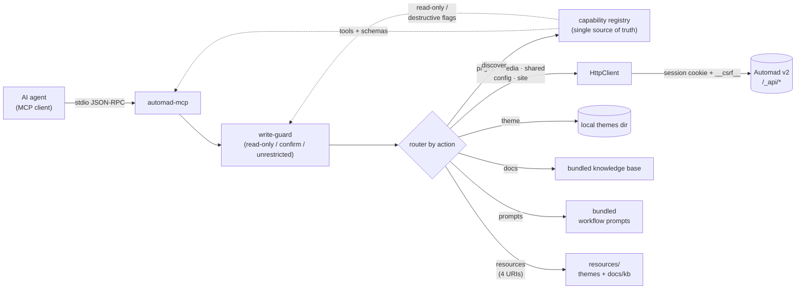

<div align="center">

# automad-mcp-server

**A [Model Context Protocol](https://modelcontextprotocol.io) server for [Automad v2](https://automad.org/)** —
manage pages, media, shared data, config, local themes, and an offline docs knowledge base from any AI agent, over stdio.

[](https://cabroe.github.io/automad-mcp-server/)
[](https://github.com/cabroe/automad-mcp-server/releases)
[](./LICENSE)
[](https://nodejs.org)
[](https://modelcontextprotocol.io)
[](https://automad.org/)

[Homepage](https://cabroe.github.io/automad-mcp-server/) · [Features](#features) · [Quick start](#quick-start) · [Install for your AI agent](#install-for-your-ai-agent) · [Configuration](#configuration) · [Tools](#tools) · [Resources & prompts](#resources--prompts) · [Examples](#examples) · [Editor setup](#editor-setup) · [Development](#development)

</div>

> [!NOTE]
> **Status: beta** — verified against a live `automad/automad:v2` Docker container and covered by unit + opt-in live E2E tests. Runs in two modes: **`full`** (live instance) and **`docs`** (standalone docs + theme tooling, no instance or credentials required).

---

## Features

| | |
|---|---|
| **<!-- AUTOGEN:TOOLCOUNT -->13<!-- /AUTOGEN:TOOLCOUNT --> tools** | `pages` · `media` · `shared` · `config` · `site` · `docs` · `theme` · `discover` — each dispatches on an `action` |
| **4 resources** | discovered themes, normalized theme schema, docs index, docs pages |
| **5 prompts** | ready-made workflows: blog post, theme scaffold, theme analysis, headless check, docs lookup |
| **Two modes** | `full` (bridges a live `/_api`) or `docs` (offline knowledge base + local theme tooling) |
| **Safe by default** | three write modes; destructive actions need a confirm token bound to `(action, target)` |
| **Offline docs** | bundled Automad v2 knowledge base — works with zero backend |
| **Theme tooling** | scaffold, build (composer + npm), `dev` server (background), analyze, validate, schema, unified-diff preview, snippet/block generator |

## Architecture




Each tool takes an `action` and dispatches to a domain router. Live-API actions map to real, live-verified `/_api/{controller}/{method}` endpoints; `automad_theme` works on the local filesystem; `automad_docs` and `automad_discover` are fully offline.

The dashed edges are the point: tools, their titles, their `action` enums and the write-guard's read-only/destructive classification are all *derived* from `src/capabilities/registry.ts`. Adding a tool means adding one registry entry plus one binding — `server.ts` holds no per-tool knowledge, and `automad_discover` can't advertise a surface that doesn't exist.

## Requirements

- **Node.js ≥ 20**
- For `full` mode: a running **Automad v2** install (e.g. `docker run -dp 8080:80 automad/automad:v2`) with dashboard access
- For `automad_theme`: `node`, `npm`, and `git` on the same host, plus read/write access to the themes directory

## Quick start

Install via npm (recommended):

```bash
npx -y automad-mcp-server
```

Or build from source:

```bash
git clone https://github.com/cabroe/automad-mcp-server.git
cd automad-mcp-server
npm install
npm run build        # outputs dist/index.js
npm start            # or: node dist/index.js
```

Then wire it into your editor — see [Editor setup](#editor-setup).
If you're driving the install from a coding agent (Claude Code, Cursor,
etc.), jump to [Install for your AI agent](#install-for-your-ai-agent).

## Install for your AI agent

If you're using a coding agent (Claude Code, Cursor, Copilot, Cline, etc.)
and want it to manage an Automad site end-to-end, the npm install above is
the simplest path. If you'd rather build from source, the steps below cover
that:


```bash
# 1. Get the server
git clone https://github.com/cabroe/automad-mcp-server.git
cd automad-mcp-server
npm install
npm run build                 # outputs dist/index.js

# 2. Make sure a running Automad v2 instance is reachable.
#    Local-only:  docker run -d --name automad -p 8080:80 automad/automad:v2
#    Remote:      ensure AUTOMAD_URL points to a reachable dashboard.
#    First run on a fresh container:  docker exec automad \
#      php /app/automad/console user:create --email you@example.com \
#        --username admin --password CHANGEME

# 3. Wire it into your MCP client config (see Editor setup below for per-editor paths).
#    Option A — install from npm:
#      command = npx
#      args    = ["-y", "automad-mcp-server"]
#    Option B — install from source (also fine, see step 1):
#      command = node
#      args    = ["<absolute path to>/automad-mcp-server/dist/index.js"]
#    env:
#      AUTOMAD_URL             = https://your-site.example.com
#      AUTOMAD_USER            = admin
#      AUTOMAD_PASS            = <password>
#      AUTOMAD_THEMES_PATH     = /absolute/path/to/automad/packages   # optional; default <cwd>/automad-themes
#      AUTOMAD_STARTER_KIT_PATH= /absolute/path/to/automad-theme-starter-kit  # optional; default = bundled kit
#      AUTOMAD_WRITE_MODE      = confirm-destructive   # or: unrestricted | read-only

# 4. Sanity-check the install: the server should start without crashing
#    (it'll wait on stdio for MCP requests). Press Ctrl-C to exit.
node /absolute/path/to/automad-mcp-server/dist/index.js
```

**Docs-only mode** (no live instance, no credentials — useful for offline
knowledge-base work and theme scaffolding):

```json
{
  "mcpServers": {
    "automad-docs": {
      "command": "node",
      "args": ["/absolute/path/to/automad-mcp-server/dist/index.js"],
      "env": { "AUTOMAD_MODE": "docs", "AUTOMAD_THEMES_PATH": "/absolute/path/to/automad/packages" }
    }
  }
}
```

Once the install is verified, see [Tools](#tools) for what the agent can do,
and [Examples](#examples) for typical workflows.

## Configuration

All configuration is via environment variables.

| Variable | Required | Default | Description |
|---|:---:|---|---|
| `AUTOMAD_MODE` | no | `full` | `full` (live instance) or `docs` (standalone docs + theme tooling) |
| `AUTOMAD_URL` | full | — | Base URL of the site, e.g. `https://blog.example.com` (validated as http/https) |
| `AUTOMAD_USER` | full | — | Dashboard username (sent as `name-or-email`) |
| `AUTOMAD_PASS` | full | — | Dashboard password |
| `AUTOMAD_THEMES_PATH` | no | `<cwd>/automad-themes` | Absolute path to the local themes directory (Automad's `packages`). Defaults to `automad-themes/` in the working directory, so `theme.scaffold` works with zero config |
| `AUTOMAD_STARTER_KIT_PATH` | no | bundled kit | Local [starter-kit](https://github.com/automadcms/automad-theme-starter-kit) checkout used by `theme.scaffold`. Defaults to the [starter kit](https://github.com/automadcms/automad-theme-starter-kit) bundled with this package |
| `AUTOMAD_HTTP_PORT` | no | — | Serve over **Streamable-HTTP** on this port instead of stdio. Unset = stdio (default). |
| `AUTOMAD_HTTP_HOST` | no | `127.0.0.1` | Bind host for the HTTP transport (loopback by default). |
| `AUTOMAD_HTTP_TOKEN` | no | auto-generated | Static Bearer token required on every HTTP request (`Authorization: Bearer <token>`). Auto-generated + logged once at startup if unset. |
| `AUTOMAD_WRITE_MODE` | no | `confirm-destructive` | `read-only` · `confirm-destructive` · `unrestricted` |
| `LOG_LEVEL` | no | `info` | `trace` · `debug` · `info` · `warn` · `error` · `fatal` · `silent` |

In **`docs` mode** the live-API tools (`pages`, `media`, `shared`, `config`, `site`) return `UNSUPPORTED`; `automad_docs`, `automad_discover`, and `automad_theme` always work. Invalid `AUTOMAD_URL` / `LOG_LEVEL` / `AUTOMAD_MODE` fail fast at startup.

**HTTP transport (multiple local clients).** Set `AUTOMAD_HTTP_PORT` to serve Streamable-HTTP on `127.0.0.1` instead of stdio. Every request must carry `Authorization: Bearer <AUTOMAD_HTTP_TOKEN>`; if the token is unset the server generates one and logs it once at startup. Each client connection is an isolated session with its own confirm-token state. The endpoint path is `/mcp`.

> [!IMPORTANT]
> **v2 has no bearer-token auth.** All authenticated calls use a PHP session cookie + a CSRF token scraped from the dashboard HTML.

<details>
<summary>How authentication & CSRF work</summary>

The server logs in once on first use (`POST /_api/session/login`, urlencoded `name-or-email` + `password`, CSRF-exempt) and stores the `Automad-<md5>` session cookie. Every authenticated `POST` then carries a `__csrf__` form field matching the token in the dashboard HTML: the AuthManager fetches `GET /dashboard` (following the `Location: /dashboard/setup` redirect on first run) and extracts it from `<meta name="csrf" content="…">`.

- A `403 CSRF token mismatch` triggers one automatic rescrape + retry.
- A freshly started (cold) v2 can 403 the post-login probe while the session settles; the login probe re-scrapes and retries up to 3× before failing, so the first call is reliable. Genuine failures (bad credentials, anonymous session) fail fast.
</details>

## Write protection

Set via `AUTOMAD_WRITE_MODE`:

| Mode | Behavior |
|---|---|
| `read-only` | Only the **<!-- AUTOGEN:READCOUNT -->33<!-- /AUTOGEN:READCOUNT --> read actions** succeed (all `docs.*`; all `discover.*`; `pages.list/get`; `media.list`; `shared.get`; `config.get`; `site.info/search/health`; `theme.list/read/files/analyze/validate/schema/diff/generate`). Everything else → `FORBIDDEN`. |
| `confirm-destructive` *(default)* | Ordinary writes run directly (`pages.create/update/duplicate/publish/batch_update`, `media.upload/delete`, `shared.set`, `config.set`). The **<!-- AUTOGEN:DESTRUCTIVECOUNT -->30<!-- /AUTOGEN:DESTRUCTIVECOUNT --> destructive actions** return a `confirmToken` (5-min TTL, bound to `(action, target)`) — replay with `confirm_token` to execute. |
| `unrestricted` | Everything runs immediately. |

Destructive actions: `pages.delete` · `pages.move` · `pages.update_rename` *(title-rename inside `pages.update`/`pages.batch_update`)* · `media.delete` · `site.search_replace` *(global replace inside `site.search`)* · `theme.install` · `theme.activate` · `theme.uninstall` · `theme.scaffold` · `theme.build` · `theme.write`.

## Tools

<!-- AUTOGEN:TOOLCOUNT_WORD -->13<!-- /AUTOGEN:TOOLCOUNT_WORD --> tools, each dispatching on `action`:

<!-- AUTOGEN:TOOLS:START -->
<!-- This table is auto-generated by `npm run docs:sync` from
     src/capabilities/registry.ts. Do not edit by hand. -->
| Tool | Actions | What it does |
|---|---|---|
| `automad_pages` | `list` `get` `create` `update` `delete` `move` `duplicate` `publish` `batch_update` `trash_list` `trash_restore` `trash_permanently_delete` `trash_clear` `history` `history_restore` `breadcrumbs` `publication_state` `recent` `discard_draft` | Manage Automad pages |
| `automad_media` | `list` `upload` `delete` | Manage Automad media |
| `automad_shared` | `get` `set` | Manage site-wide shared data |
| `automad_config` | `get` `set` `cache_clear` `cache_purge` | Manage Automad configuration |
| `automad_site` | `info` `search` `health` | Inspect and search the site |
| `automad_docs` | `list` `search` `get` | Offline Automad v2 knowledge base |
| `automad_theme` | `list` `install` `activate` `uninstall` `list_installed` `outdated` `update` `update_all` `scaffold` `build` `dev` `dev_stop` `dev_status` `read` `write` `files` `analyze` `validate` `schema` `diff` `generate` | Manage and inspect local themes |
| `automad_image` | `list` `save` | Manage image variants via v2 image controllers |
| `automad_components` | `data` `publication_state` `discard_draft` `publish` | Manage per-page component fields (v2 ComponentController) |
| `automad_mail` | `save` `test` `reset` | Manage Automad mail configuration (v2 MailConfigController) |
| `automad_system` | `check_for_update` `update` | Check for and run Automad core updates (v2 SystemController) |
| `automad_file_meta` | `edit_info` | Edit file metadata (alt text, etc.) via v2 FileController |
| `automad_discover` | `list` `describe` | Introspect available tools and actions |
<!-- AUTOGEN:TOOLS:END -->

<details>
<summary>Discovery facade: <code>automad_discover</code></summary>

Lets an agent enumerate the whole tool/action surface, or pull one action's
full input schema, on demand — instead of holding all ~38 actions in context
up front:

```jsonc
{ "action": "list" }
// → { "capabilities": [{ "tool": "automad_pages", "action": "delete", "writeAction": "pages.delete",
//                        "readOnly": false, "destructive": true, "requires": "live", "summary": "Delete a page." }, …] }

{ "action": "describe", "tool": "automad_pages", "target_action": "delete" }
// → { "tool": "automad_pages", "title": "Pages", "summary": "Manage Automad pages.",
//     "description": "Manage Automad v2 pages: …", "requires": "live",
//     "actions": { "delete": { "readOnly": false, "destructive": true, "description": "Delete a page." } },
//     "inputSchema": { "type": "object", "properties": { "action": …, "url": …, … } } }
```

Always read-only, works in every write mode and in `AUTOMAD_MODE=docs`, and
reflects live-API tools' actions even when those tools are themselves disabled
(`requires` says what a tool needs: `live`, `themes`, or `none`).

The facade is not a parallel description of the server — it reads the same
capability registry (`src/capabilities/registry.ts`) that the server registers
tools from, that the write-guard classifies actions with, that every tool's Zod
`action` enum is built from, and that this README's tool table is generated
from. One entry per tool, one entry per action; everything else is derived, so
discovery can't advertise a surface that doesn't exist.
</details>

<details>
<summary>Theme analysis: <code>analyze</code>, <code>validate</code>, <code>schema</code></summary>

`analyze` inventories a local theme without executing code or touching the network — manifests, root templates, `components/`, `blocks/`, `client/`, `icons/`, `i18n/`, `lib/`, build files, Automad field references, block fields, masks, and recognized Starter-Kit markers:

```json
{ "action": "analyze", "theme": "my-theme" }
```

`validate` runs the same inventory and returns `ok`, ordered `findings`, and severity counts (checks `theme.json`, optional `package.json`/`composer.json`, root templates, i18n JSON, metadata consistency, field masks, build markers):

```json
{ "action": "validate", "theme": "my-theme" }
```

`schema` builds a normalized, read-only field schema from the analysis:

```json
{ "action": "schema", "theme": "my-theme" }
```

All three are read-only in every write mode and never run npm, Composer, Git, PHP, JS, Docker, or a browser. A missing theme returns `NOT_FOUND`; malformed manifests surface as validation findings. Each field carries its Automad type (`text`, `checkbox`, `color`, `image`, `icon`, `select`, `url`, `format`, `label`, `filter`, or `block`), scope (`page`/`shared`/`unmasked`), source files, labels, options, tooltips, and field order. Unknown prefixes fall back to `text` with an `UNKNOWN_FIELD_PREFIX` warning.

**Locale metadata** — the Starter Kit translates dashboard field metadata via `i18n/<locale>.json`:

```json
{
  "labels": { "brand": "Branding Logo (SVG, HTML oder Text)" },
  "options": { "selectColorTheme": { "light": "Hell", "dark": "Dunkel" } },
  "tooltips": { "+main": "Der Haupt-Inhalt" }
}
```
</details>

<details>
<summary>Live theme dev server: <code>dev</code> / <code>dev_stop</code> / <code>dev_status</code></summary>

`dev` starts the theme's own dev script (`npm run dev`) as a **detached background process**, returns immediately, and reports back the local URL. Useful for letting an agent iterate on a theme while you watch the result in a browser.

```jsonc
// 1. start (destructive in default write mode → confirm token)
{ "action": "dev", "theme": "my-theme" }
// → { "pid": 88328, "port": 8000,
//     "startedAt": "2026-07-26T15:59:39.078Z",
//     "logPath": "/app/packages/my-theme/.automad-mcp/dev.log",
//     "url": "http://localhost:8000",
//     "running": true }

// 2. health check (read-only)
{ "action": "dev_status", "theme": "my-theme" }
// → { "pid": 88328, "port": 8000, "url": "http://localhost:8000", "running": true }

// 3. stop (destructive)
{ "action": "dev_stop", "theme": "my-theme" }
// → { "stopped": true, "signalUsed": "SIGTERM", "wasLive": true }
```

State lives at `<theme>/.automad-mcp/{dev.json,dev.log}`. The process runs in its own process group (`spawn(detached: true).unref()`), so the MCP server can exit without taking the dev server down. `npm install` runs only when `node_modules/` is missing; the port is discovered in this order: an explicit `port` argument → `package.json` `scripts.dev` (`--port=N`, `PORT=N`) → the first `http://localhost:<port>` marker in `dev.log` (up to 20 s). A second `dev` call for the same theme returns `CONFLICT` until `dev_stop` is called.

Pair it with `confirm_token` flow when `AUTOMAD_WRITE_MODE=confirm-destructive`. The dev server does not auto-open a browser — open the returned `url` yourself.
</details>

## Resources & prompts

**Resources** (read-only, static for the process lifetime):

| URI | Returns |
|---|---|
| `automad://themes` | JSON list of discovered themes with manifest metadata |
| `automad://themes/{slug}/schema` | JSON normalized theme schema (same as `automad_theme.schema`) |
| `automad://docs` | JSON index of the bundled knowledge-base pages |
| `automad://docs/{slug}` | Markdown body of one page (e.g. `automad://docs/template-syntax`) |

`{slug}` must match `^[a-z0-9._-]+$`; invalid slugs return `NOT_FOUND`. Theme resources read from the themes directory (`AUTOMAD_THEMES_PATH`, default `<cwd>/automad-themes`) and list nothing until a theme exists there.

**Prompts** (arguments are strings, per the MCP prompt contract):

| Prompt | Arguments | Workflow |
|---|---|---|
| `create_blog_post` | `title`, `parent?`, `summary?` | draft → fill → publish a page |
| `scaffold_theme` | `name`, `author?` | scaffold → generate → diff → write → build → activate |
| `analyze_theme` | `theme` | analyze + validate + schema → prioritized fixes |
| `check_headless_setup` | — | `site.health` + config + headless docs |
| `find_docs` | `topic` | search the knowledge base → get → summarize |

<details>
<summary>Internal capability registry</summary>

The server keeps the public routers unchanged and maintains a static internal registry of action metadata (read-only/destructive), validated during construction (`validateCapabilityRegistry`). It is not exposed as one tool per action — `automad_discover` reads it through two actions (`list`/`describe`) instead — and does no filesystem/network/token/audit work — later scoped tokens, audit logging, and HTTP authorization can reuse the same metadata without changing the public contract.
</details>

## Examples

**Confirm-token flow** (destructive action in the default write mode):

```jsonc
// 1. destructive call → returns a pending token (nothing deleted yet)
{ "action": "delete", "url": "/blog/old-post" }
// → { "allowed": "pending", "confirmToken": "a1b2…", "expiresAt": "…" }

// 2. replay with the token → executes
{ "action": "delete", "url": "/blog/old-post", "confirm_token": "a1b2…" }
// → { "ok": true }
```

**Scaffold → edit → preview → build → activate a theme:**

```jsonc
{ "action": "scaffold", "name": "My Theme", "author": "me" }
// → { "path": "/app/packages/my-theme", "files": 56, "manifest": { "name": "My Theme", … } }

{ "action": "write", "theme": "my-theme", "path": "blocks/grid.php", "content": "<?php /* edited via MCP */ ?>" }

// optional: start the theme's dev server in the background and open the URL
{ "action": "dev", "theme": "my-theme" }
// → { "url": "http://localhost:8000", "running": true, … }

{ "action": "build", "theme": "my-theme" }
// → { "install": { "ok": true, … }, "build": { "ok": true, … } }

{ "action": "activate", "theme": "my-theme" }
// → { "activated": true, "remote": { "code": 200 } }   or   { "activated": false, … }

{ "action": "dev_stop", "theme": "my-theme" }
// → { "stopped": true, "signalUsed": "SIGTERM" }
```

> [!TIP]
> `theme.build` runs `composer install` first when a `composer.json` is present, then `npm install` + `npm run build`. Pass `install: false` to skip installs and only re-run the build. `theme.dev` reuses the same `node_modules/` when it's already there — no second install.

**Bind a page to a specific theme/template:**

v2's `page/add` endpoint splits the `template` field on `/` and appends `.php`:
pass `"{theme}/{template}"` (no extension) on `pages.create` to bind a page to
a theme that isn't the site default. The site default itself isn't exposed
via the API — it's set in the dashboard.

```jsonc
// create a page bound to my-theme's default template
{ "action": "create", "target_url": "/", "url": "/hello", "title": "Hello",
  "template": "my-theme/default" }
// → { "ok": true, "url": "/hello" }

// the page's data now carries the binding
{ "action": "get", "url": "/hello" }
// → { "title": "Hello", "theme": "my-theme", "template": "default", … }
```

> [!NOTE]
> Theme templates use Automad's `<# #>` / `<@ @>` markup, not raw PHP — the
> `$Automad` context is only set up by the markup engine. After editing
> templates, clear Automad's page cache (`/cache/*` in the install) so the
> next request picks up the new template.

```jsonc
// read-only unified-diff preview (nothing is written)
{ "action": "diff", "theme": "my-theme", "path": "snippets/nav.php", "content": "<@ snippet nav @>…<@ end @>" }
// → { "path": "snippets/nav.php", "changed": true, "added": 12, "removed": 0, "diff": "--- a/… +++ b/…" }

// generate a recursive nav snippet (returns path + content; persist with `write`)
{ "action": "generate", "kind": "nav", "name": "mainNav" }
// → { "kind": "nav", "path": "snippets/mainNav.php", "content": "<@ snippet mainNav @>…", "notes": "…" }
```

Generator kinds: `nav` · `pagelist` · `breadcrumbs` · `component` · `block` · `i18n` · `snippet`.

<details>
<summary>Using a custom Starter Kit for <code>theme.scaffold</code></summary>
`theme.scaffold` ships with the full [Automad theme starter kit](https://github.com/automadcms/automad-theme-starter-kit) **bundled inside the package** (`templates/starter-kit`), so it works out of the box — no download, no `AUTOMAD_STARTER_KIT_PATH`. It copies the kit into `AUTOMAD_THEMES_PATH/<slug>` (default `<cwd>/automad-themes/<slug>`) and rewrites `theme.json` + `package.json`. Before copying, it verifies the kit has the canonical layout (`theme.json`, `components/`, `blocks/`, `client/index.ts`, `esbuild.js`, `bin/dev.sh`, `bin/server.sh`); missing entries fail with `VALIDATION` and no files are written.

Set `AUTOMAD_STARTER_KIT_PATH` only to override the bundled kit with your own local checkout:

```bash
git clone --depth 1 https://github.com/automadcms/automad-theme-starter-kit.git ~/automad-starter-kit
```
```json
"AUTOMAD_STARTER_KIT_PATH": "/Users/you/automad-starter-kit"
```
</details>

## Editor setup

### Claude Desktop / Claude Code

Add to `claude_desktop_config.json` (macOS: `~/Library/Application Support/Claude/`):

```json
{
  "mcpServers": {
    "automad": {
      "command": "node",
      "args": ["/absolute/path/to/automad-mcp-server/dist/index.js"],
      "env": {
        "AUTOMAD_URL": "https://blog.example.com",
        "AUTOMAD_USER": "admin",
        "AUTOMAD_PASS": "your-password",
        "AUTOMAD_THEMES_PATH": "/app/packages",
        "AUTOMAD_WRITE_MODE": "confirm-destructive"
      }
    }
  }
}
```

To run a local build instead: `"command": "node", "args": ["/absolute/path/to/dist/index.js"]` with the same `env`.

**Docs-only mode** — no instance, no credentials:

```json
{
  "mcpServers": {
    "automad-docs": {
      "command": "node",
      "args": ["/absolute/path/to/automad-mcp-server/dist/index.js"],
      "env": { "AUTOMAD_MODE": "docs" }
    }
  }
}
```

<details>
<summary>Cursor · Cline · Zed</summary>

**Cursor** — `~/.cursor/mcp.json` (or per-project `.cursor/mcp.json`):

```json
{
  "mcpServers": {
    "automad": {
      "command": "node",
      "args": ["/absolute/path/to/automad-mcp-server/dist/index.js"],
      "env": { "AUTOMAD_URL": "https://blog.example.com", "AUTOMAD_USER": "admin", "AUTOMAD_PASS": "your-password" }
    }
  }
}
```

**Cline (VS Code)** — in `cline_mcp_settings.json`:

```json
{
  "mcpServers": {
    "automad": {
      "command": "node",
      "args": ["/absolute/path/to/automad-mcp-server/dist/index.js"],
      "env": { "AUTOMAD_URL": "https://blog.example.com", "AUTOMAD_USER": "admin", "AUTOMAD_PASS": "your-password" }
    }
  }
}
```

**Zed** — in `settings.json` under `context_servers`:

```json
{
  "context_servers": {
    "automad": {
      "command": { "path": "node", "args": ["/absolute/path/to/automad-mcp-server/dist/index.js"] },
      "settings": {}
    }
  }
}
```
</details>

## v2 reality

<details>
<summary>Supported vs. not exposed</summary>

**Every `/_api/*` call in the [tool table above](#tools) is a real v2 endpoint** (live-verified
against `automad/automad:v2` `2.0.0-beta.51`). A few need a special note:

- `pages.move` → `/_api/page/move` is **sibling-reordering / reparenting**, not a
  title rename; renames happen implicitly during `page/publish` when the title
  changes.
- `theme.activate` is best-effort via `/_api/package-manager/install`; if v2
  declines, the theme is still on disk (`activated: false`, not an error).
- `site.search` becomes `site.search_replace` (a separate destructive action,
  requiring a confirm token) when the caller supplies a `replace` value.
- `pages.update` / `pages.batch_update` switch to the destructive
  `pages.update_rename` action when they carry a title change — see the
  [destructive actions list](#write-protection) above.
- `pages.update` reads the page before writing it. v2's `page/data` save is a
  **full replace** and rejects any payload without a `title` ("Title missing!"),
  so a partial update has to merge onto the stored record — otherwise every
  field the caller didn't mention would be deleted. That costs one extra read
  per update.
- The same replace applies to the **template binding**: a save without
  `theme_template` resets the page to the site default with an empty template
  name, and the public URL then answers `500 Template missing!`. `pages.update`
  carries the stored selection forward unless you pass `template`.
- Templates are addressed **`{vendor}/{theme}/{template}`** (v2 splits at the
  last slash and resolves against `packages/`), e.g. `mcp/cafe/home` for
  `packages/mcp/cafe/home.php`.
- A draft (`publish: false`) is readable through the dashboard API; what marks
  it as a draft is `pages.publication_state` (`isPublished: false`), not a
  failing read.
- `/_api/app/bootstrap` is **public** — it answers anonymous callers with the
  full payload — so the login check probes the session-protected
  `/_api/shared/data` instead. A wrong password shows up as HTTP 200 with an
  `error` key, both on login and on the probe.

**Not exposed (no v2 endpoint):**

- `media.rename` — v2 has no in-place rename; the closest is `action: "move"`
  (between directories). `media.delete` is exposed (destructive in the default
  write mode).
- `snippets`, `templates` — v1-era; in v2 these are components / shared data.
- `site.backup` / `site.restore`
- `config.validate`

**Known v2-side issue:** `/_api/public/pagelist` currently 500s on
`2.0.0-beta.51` (Automad bug, `PublicController.php:107`); `automad_pages.list`
uses `/_api/page-collection/get-recently-edited` instead.
</details>

## Development

```bash
npm install
npm run build          # tsc → dist/ (also reads package.json#version)
npm test               # vitest — offline unit + domain suite (no instance needed)
npm run test:coverage
npm run lint           # eslint
npm run dev            # tsx src/index.ts

# Keep the auto-generated tool tables + fenced number markers (tool/read/
# destructive counts) in README.md, CLAUDE.md and the GitHub Pages homepage
# (docs/index.html) in sync with the code:
npm run docs:sync              # fast, pure — safe to run in every CI job
npm run docs:sync -- --check   # same, exits 1 if anything was stale (used in CI)

# Also refresh the <!-- AUTOGEN:TESTCOUNT --> marker (spawns a full `vitest
# run`; run this after adding/removing tests, then commit the diff):
npm run docs:sync:tests

# Version-bump helpers (commit + tag locally; you push manually):
npm run release:patch  # 0.6.x → 0.6.(x+1)
npm run release:minor  # 0.6.x → 0.7.0
npm run release:major  # 0.6.x → 1.0.0
# Same with a GitHub release on top: tag, push, and `gh release create`
# in one go. Requires `gh auth status` to be logged in.
npm run release:full:patch
npm run release:full:minor
npm run release:full:major
# Add `--dry-run` to any of the above to preview without writing files.
```

### Test environment (live E2E)

The E2E suite runs against a **real** Automad v2 container, not mocks. One
command builds the whole thing — container, admin user, environment file:

```bash
npm run e2e            # build + start the container + run the live suite
npm run e2e:up         # just the environment (idempotent; safe to re-run)
npm run e2e:run        # just the tests (needs a built dist/)
npm run e2e:status     # container state + HTTP probe + login probe
npm run e2e:logs       # tail the Automad log
npm run e2e:serve      # run the MCP server (full mode, stdio) against the container
npm run e2e:down       # destroy everything: docker compose down -v + rm .env.e2e
```

`e2e:up` starts `docker-compose.e2e.yml` (a throwaway `automad/automad:v2` on
`127.0.0.1:8899` with a named volume), waits until the instance answers,
creates a **deterministic** dashboard admin — the image otherwise generates a
random user and password on first boot — and writes `.env.e2e`, which the suite
loads automatically. Nothing is committed: `.env.e2e` is gitignored and
`e2e:down` removes both the volume and the file.

| Variable | Default | Purpose |
|---|---|---|
| `AUTOMAD_E2E_PORT` | `8899` | Host port for the test instance |
| `AUTOMAD_E2E_USER` | `mcpadmin` | Dashboard admin created by `e2e:up` |
| `AUTOMAD_E2E_PASS` | `mcp-e2e-secret` | Its password |
| `AUTOMAD_E2E_EMAIL` | `mcp-e2e@example.invalid` | Its email |
| `AUTOMAD_E2E_TIMEOUT_MS` | `180000` | How long `e2e:up` waits for the instance |

The stack also bind-mounts `automad-themes/` (the `AUTOMAD_THEMES_PATH`
default) into the container at `/app/packages/mcp`, so a theme you scaffold
through `automad_theme` is immediately usable by the running site — bind a page
to `mcp/<slug>/<template>` and it renders. That is what
`tests/e2e/render.e2e.test.ts` verifies: it builds a theme, binds a page, and
asserts the **public** HTML a visitor gets.

The suite (`tests/e2e/**`, own `vitest.e2e.config.ts`) covers login + CSRF
handling, the page lifecycle including drafts and renames, media upload/delete
against the real Dropzone endpoint, shared data + config, theme scaffolding and
analysis, and all three write modes including the confirm-token flow. Files run
sequentially — v2 races on concurrent writes to the same page tree — and every
test cleans up its own fixtures. Without `AUTOMAD_E2E_*` the whole suite skips
itself, so `npm test` stays offline. The nightly
[`e2e.yml`](.github/workflows/e2e.yml) workflow runs the exact same commands.

<details>
<summary>Project layout</summary>

```
src/
  index.ts          entry: config, stdio transport, graceful shutdown
  server.ts         McpServer: registry-driven tool loop + 4 resource + 5 prompt registrations
  config.ts         env loader: mode split, URL/log-level validation, write-mode
  auth.ts           session login + cookie jar + CSRF scrape (cold-start retry)
  client.ts         HTTP client: /_api envelope unwrap, multipart __csrf__+__json__, retry + re-CSRF
  errors.ts         typed AutomadMcpError
  logger.ts         pino with credential redaction
  schemas.ts        Zod input schemas for all tools (`action` enums built from the registry)
  write-guard.ts    multi-tier write protection + confirm-token flow (action sets derived from the registry)
  prompts.ts        MCP workflow prompts
  docs/kb.ts        bundled offline knowledge base (automad_docs)
  domains/          one router per tool: pages, media, shared, config, site, theme, docs, discover
  theme/            theme tooling, Starter-Kit analysis, normalized schemas
    schema.ts       pure normalized ThemeSchemaBuilder
    diff.ts         unified-diff preview for theme.diff
    generate.ts     snippet/block/component generator
  resources/        MCP resource backers (themes)
  capabilities/
    registry.ts     single source of truth: one entry per tool/action; derives the
                    WriteAction union, the write-guard sets, the Zod action enums,
                    automad_discover and the generated docs table
    tools.ts        wiring layer: one binding per tool (schema + gate + dispatch)
tests/unit/         Vitest unit and domain tests (offline)
tests/e2e/          opt-in live E2E vs. a real Automad v2 container (npm run e2e)
  harness.ts        spawns dist/index.js over stdio via the MCP SDK client; call helpers + cleanup registry
  env.ts            vitest setup: loads .env.e2e (real env vars win)
docker-compose.e2e.yml  throwaway Automad v2 stack for the E2E suite
vitest.e2e.config.ts    E2E runner config (sequential, long timeouts)
docs/index.html     GitHub Pages landing page (self-contained; tool table + counts are AUTOGEN regions)
scripts/            TypeScript build-time helpers (run via `npm run <name>`)
  testenv.ts        E2E environment: docker compose up/down/status/logs + deterministic admin + .env.e2e
  sync.ts           regenerates the AUTOGEN tool table + fenced number markers in README/CLAUDE.md/docs/index.html (--tests refreshes TESTCOUNT via a live vitest run)
  release.ts        version-bump + CHANGELOG skeleton + git tag (`--tag` / `--dry-run`)
```
</details>

## Known limitations

- **`pages.list` endpoint limitation** — Automad v2 currently lacks a native `/_api/page-collection/all` endpoint. `pages.list` uses `/_api/page-collection/get-recently-edited` as a workaround.
- **Package manager support** — Theme dev and build commands default to `npm` but support `AUTOMAD_PACKAGE_MANAGER=bun|pnpm|npm`. If the package manager executable is missing from `PATH`, the MCP returns a clear `VALIDATION` error instead of spawning a failing child process.
- **API-token auth** — Automad v2 only provides session cookie + CSRF authentication. The MCP handles cookie scraping and session renewal automatically.
## License

[MIT](./LICENSE)
