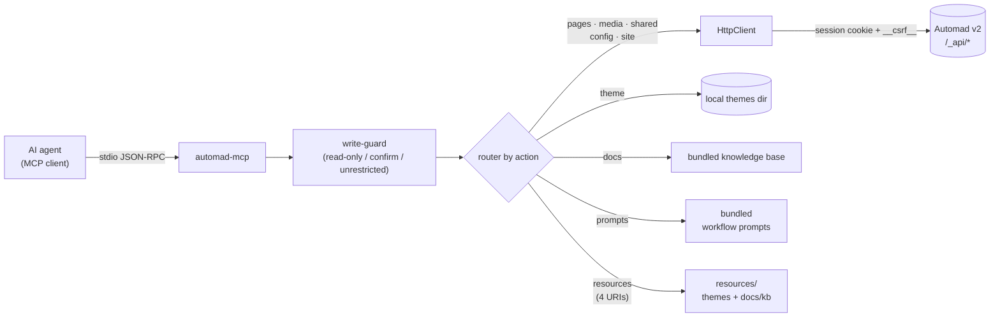

<div align="center">

# @automadcms/mcp-server

**A [Model Context Protocol](https://modelcontextprotocol.io) server for [Automad v2](https://automad.org/)** —
manage pages, media, shared data, config, local themes, and an offline docs knowledge base from any AI agent, over stdio.

[](https://github.com/cabroe/automad-mcp-server/releases)
[](./LICENSE)
[](https://nodejs.org)
[](https://modelcontextprotocol.io)
[](https://automad.org/)

[Features](#features) · [Quick start](#quick-start) · [Install for your AI agent](#install-for-your-ai-agent) · [Configuration](#configuration) · [Tools](#tools) · [Resources & prompts](#resources--prompts) · [Examples](#examples) · [Editor setup](#editor-setup) · [Development](#development)

</div>

> [!NOTE]
> **Status: beta** — verified against a live `automad/automad:v2` Docker container and covered by unit + opt-in live E2E tests. Runs in two modes: **`full`** (live instance) and **`docs`** (standalone docs + theme tooling, no instance or credentials required).

---

## Features

| | |
|---|---|
| **7 tools** | `pages` · `media` · `shared` · `config` · `site` · `docs` · `theme` — each dispatches on an `action` |
| **4 resources** | discovered themes, normalized theme schema, docs index, docs pages |
| **5 prompts** | ready-made workflows: blog post, theme scaffold, theme analysis, headless check, docs lookup |
| **Two modes** | `full` (bridges a live `/_api`) or `docs` (offline knowledge base + local theme tooling) |
| **Safe by default** | three write modes; destructive actions need a confirm token bound to `(action, target)` |
| **Offline docs** | bundled Automad v2 knowledge base — works with zero backend |
| **Theme tooling** | scaffold, build (composer + npm), analyze, validate, schema, unified-diff preview, snippet/block generator |

## Architecture




Each tool takes an `action` and dispatches to a domain router. Live-API actions map to real, live-verified `/_api/{controller}/{method}` endpoints; `automad_theme` works on the local filesystem; `automad_docs` is fully offline.

## Requirements

- **Node.js ≥ 20**
- For `full` mode: a running **Automad v2** install (e.g. `docker run -dp 8080:80 automad/automad:v2`) with dashboard access
- For `automad_theme`: `node`, `npm`, and `git` on the same host, plus read/write access to the themes directory

## Quick start

The package isn't on npm yet, so install from source:

```bash
git clone https://github.com/cabroe/automad-mcp-server.git
cd automad-mcp-server
npm install
npm run build        # outputs dist/index.js
npm start            # or: node dist/index.js
```

Then wire it into your editor — see [Editor setup](#editor-setup).
If you're driving the install from a coding agent (Claude Code, Cursor,
etc.), jump to [Install for your AI agent](#install-for-your-ai-agent).

## Install for your AI agent

If you're using a coding agent (Claude Code, Cursor, Copilot, Cline, etc.)
and want it to manage an Automad site end-to-end, give it these instructions
verbatim — they cover the only working install path until the npm package is
published:

```bash
# 1. Get the server
git clone https://github.com/cabroe/automad-mcp-server.git
cd automad-mcp-server
npm install
npm run build                 # outputs dist/index.js

# 2. Make sure a running Automad v2 instance is reachable.
#    Local-only:  docker run -d --name automad -p 8080:80 automad/automad:v2
#    Remote:      ensure AUTOMAD_URL points to a reachable dashboard.
#    First run on a fresh container:  docker exec automad \
#      php /app/automad/console user:create --email you@example.com \
#        --username admin --password CHANGEME

# 3. Wire it into your MCP client config (see Editor setup below for per-editor paths).
#    command = node  (NOT npx — the package is not on npm yet)
#    args    = ["<absolute path to>/automad-mcp-server/dist/index.js"]
#    env:
#      AUTOMAD_URL             = https://your-site.example.com
#      AUTOMAD_USER            = admin
#      AUTOMAD_PASS            = <password>
#      AUTOMAD_THEMES_PATH     = /absolute/path/to/automad/packages
#      AUTOMAD_STARTER_KIT_PATH= /absolute/path/to/automad-theme-starter-kit
#      AUTOMAD_WRITE_MODE      = confirm-destructive   # or: unrestricted | read-only

# 4. Sanity-check the install: the server should start without crashing
#    (it'll wait on stdio for MCP requests). Press Ctrl-C to exit.
node /absolute/path/to/automad-mcp-server/dist/index.js
```

**Docs-only mode** (no live instance, no credentials — useful for offline
knowledge-base work and theme scaffolding):

```json
{
  "mcpServers": {
    "automad-docs": {
      "command": "node",
      "args": ["/absolute/path/to/automad-mcp-server/dist/index.js"],
      "env": { "AUTOMAD_MODE": "docs", "AUTOMAD_THEMES_PATH": "/absolute/path/to/automad/packages" }
    }
  }
}
```

Once the install is verified, see [Tools](#tools) for what the agent can do,
and [Examples](#examples) for typical workflows.

## Configuration

All configuration is via environment variables.

| Variable | Required | Default | Description |
|---|:---:|---|---|
| `AUTOMAD_MODE` | no | `full` | `full` (live instance) or `docs` (standalone docs + theme tooling) |
| `AUTOMAD_URL` | full | — | Base URL of the site, e.g. `https://blog.example.com` (validated as http/https) |
| `AUTOMAD_USER` | full | — | Dashboard username (sent as `name-or-email`) |
| `AUTOMAD_PASS` | full | — | Dashboard password |
| `AUTOMAD_THEMES_PATH` | for theme tool | — | Absolute path to the local themes directory (Automad's `packages`) |
| `AUTOMAD_STARTER_KIT_PATH` | no | = themes path | Local [starter-kit](https://github.com/automadcms/automad-theme-starter-kit) checkout used by `theme.scaffold` |
| `AUTOMAD_WRITE_MODE` | no | `confirm-destructive` | `read-only` · `confirm-destructive` · `unrestricted` |
| `LOG_LEVEL` | no | `info` | `trace` · `debug` · `info` · `warn` · `error` · `fatal` · `silent` |

In **`docs` mode** the live-API tools (`pages`, `media`, `shared`, `config`, `site`) return `UNSUPPORTED`; `automad_docs` and (when `AUTOMAD_THEMES_PATH` is set) `automad_theme` still work. Invalid `AUTOMAD_URL` / `LOG_LEVEL` / `AUTOMAD_MODE` fail fast at startup.

> [!IMPORTANT]
> **v2 has no bearer-token auth.** All authenticated calls use a PHP session cookie + a CSRF token scraped from the dashboard HTML.

<details>
<summary>How authentication & CSRF work</summary>

The server logs in once on first use (`POST /_api/session/login`, urlencoded `name-or-email` + `password`, CSRF-exempt) and stores the `Automad-<md5>` session cookie. Every authenticated `POST` then carries a `__csrf__` form field matching the token in the dashboard HTML: the AuthManager fetches `GET /dashboard` (following the `Location: /dashboard/setup` redirect on first run) and extracts it from `<meta name="csrf" content="…">`.

- A `403 CSRF token mismatch` triggers one automatic rescrape + retry.
- A freshly started (cold) v2 can 403 the post-login probe while the session settles; the login probe re-scrapes and retries up to 3× before failing, so the first call is reliable. Genuine failures (bad credentials, anonymous session) fail fast.
</details>

## Write protection

Set via `AUTOMAD_WRITE_MODE`:

| Mode | Behavior |
|---|---|
| `read-only` | Only the **19 read actions** succeed (all `docs.*`; `pages.list/get`; `media.list`; `shared.get`; `config.get`; `site.info/search/health`; `theme.list/read/files/analyze/validate/schema/diff/generate`). Everything else → `FORBIDDEN`. |
| `confirm-destructive` *(default)* | Ordinary writes run directly (`pages.create/update/duplicate/publish/batch_update`, `media.upload/delete`, `shared.set`, `config.set`). The **11 destructive actions** return a `confirmToken` (5-min TTL, bound to `(action, target)`) — replay with `confirm_token` to execute. |
| `unrestricted` | Everything runs immediately. |

Destructive actions: `pages.delete` · `pages.move` · `pages.update_rename` *(title-rename inside `pages.update`/`pages.batch_update`)* · `media.delete` · `site.search_replace` *(global replace inside `site.search`)* · `theme.install` · `theme.activate` · `theme.uninstall` · `theme.scaffold` · `theme.build` · `theme.write`.

## Tools

Seven tools, each dispatching on `action`:

<!-- AUTOGEN:TOOLS:START -->
<!-- This table is auto-generated by `npm run docs:sync` from
     src/capabilities/registry.ts. Do not edit by hand. -->
| Tool | Actions | What it does |
|---|---|---|
| `automad_pages` | `list` `get` `create` `update` `delete` `move` `duplicate` `publish` `batch_update` | Manage Automad pages |
| `automad_media` | `list` `upload` `delete` | Manage Automad media |
| `automad_shared` | `get` `set` | Manage site-wide shared data |
| `automad_config` | `get` `set` | Manage Automad configuration |
| `automad_site` | `info` `search` `health` | Inspect and search the site |
| `automad_docs` | `list` `search` `get` | Offline Automad v2 knowledge base |
| `automad_theme` | `list` `install` `activate` `uninstall` `scaffold` `build` `read` `write` `files` `analyze` `validate` `schema` `diff` `generate` | Manage and inspect local themes |
<!-- AUTOGEN:TOOLS:END -->

<details>
<summary>Theme analysis: <code>analyze</code>, <code>validate</code>, <code>schema</code></summary>

`analyze` inventories a local theme without executing code or touching the network — manifests, root templates, `components/`, `blocks/`, `client/`, `icons/`, `i18n/`, `lib/`, build files, Automad field references, block fields, masks, and recognized Starter-Kit markers:

```json
{ "action": "analyze", "theme": "my-theme" }
```

`validate` runs the same inventory and returns `ok`, ordered `findings`, and severity counts (checks `theme.json`, optional `package.json`/`composer.json`, root templates, i18n JSON, metadata consistency, field masks, build markers):

```json
{ "action": "validate", "theme": "my-theme" }
```

`schema` builds a normalized, read-only field schema from the analysis:

```json
{ "action": "schema", "theme": "my-theme" }
```

All three are read-only in every write mode and never run npm, Composer, Git, PHP, JS, Docker, or a browser. A missing theme returns `NOT_FOUND`; malformed manifests surface as validation findings. Each field carries its Automad type (`text`, `checkbox`, `color`, `image`, `icon`, `select`, `url`, `format`, `label`, `filter`, or `block`), scope (`page`/`shared`/`unmasked`), source files, labels, options, tooltips, and field order. Unknown prefixes fall back to `text` with an `UNKNOWN_FIELD_PREFIX` warning.

**Locale metadata** — the Starter Kit translates dashboard field metadata via `i18n/<locale>.json`:

```json
{
  "labels": { "brand": "Branding Logo (SVG, HTML oder Text)" },
  "options": { "selectColorTheme": { "light": "Hell", "dark": "Dunkel" } },
  "tooltips": { "+main": "Der Haupt-Inhalt" }
}
```

`schema` returns every locale alongside the base metadata; locale entries are sparse overrides, missing translations fall back to `theme.json`. Invalid sections surface as `INVALID_I18N_*` warnings while valid values are retained.
</details>

## Resources & prompts

**Resources** (read-only, static for the process lifetime):

| URI | Returns |
|---|---|
| `automad://themes` | JSON list of discovered themes with manifest metadata |
| `automad://themes/{slug}/schema` | JSON normalized theme schema (same as `automad_theme.schema`) |
| `automad://docs` | JSON index of the bundled knowledge-base pages |
| `automad://docs/{slug}` | Markdown body of one page (e.g. `automad://docs/template-syntax`) |

`{slug}` must match `^[a-z0-9._-]+$`; invalid slugs return `NOT_FOUND`. Theme resources need `AUTOMAD_THEMES_PATH` for meaningful output.

**Prompts** (arguments are strings, per the MCP prompt contract):

| Prompt | Arguments | Workflow |
|---|---|---|
| `create_blog_post` | `title`, `parent?`, `summary?` | draft → fill → publish a page |
| `scaffold_theme` | `name`, `author?` | scaffold → generate → diff → write → build → activate |
| `analyze_theme` | `theme` | analyze + validate + schema → prioritized fixes |
| `check_headless_setup` | — | `site.health` + config + headless docs |
| `find_docs` | `topic` | search the knowledge base → get → summarize |

<details>
<summary>Internal capability registry</summary>

The server keeps the public routers unchanged and maintains a static internal registry of action metadata (read-only/destructive), validated during construction (`validateCapabilityRegistry`). It is not exposed as one tool per action and does no filesystem/network/token/audit work — later scoped tokens, audit logging, and HTTP authorization can reuse the same metadata without changing the public contract.
</details>

## Examples

**Confirm-token flow** (destructive action in the default write mode):

```jsonc
// 1. destructive call → returns a pending token (nothing deleted yet)
{ "action": "delete", "url": "/blog/old-post" }
// → { "allowed": "pending", "confirmToken": "a1b2…", "expiresAt": "…" }

// 2. replay with the token → executes
{ "action": "delete", "url": "/blog/old-post", "confirm_token": "a1b2…" }
// → { "ok": true }
```

**Scaffold → edit → build → activate a theme:**

```jsonc
{ "action": "scaffold", "name": "My Theme", "author": "me" }
// → { "path": "/app/packages/my-theme", "files": 56, "manifest": { "name": "My Theme", … } }

{ "action": "write", "theme": "my-theme", "path": "blocks/grid.php", "content": "<?php /* edited via MCP */ ?>" }

{ "action": "build", "theme": "my-theme" }
// → { "install": { "ok": true, … }, "build": { "ok": true, … } }

{ "action": "activate", "theme": "my-theme" }
// → { "activated": true, "remote": { "code": 200 } }   or   { "activated": false, … }
```

> [!TIP]
> `theme.build` runs `composer install` first when a `composer.json` is present, then `npm install` + `npm run build`. Pass `install: false` to skip installs and only re-run the build.

**Preview a change, then generate a snippet:**

```jsonc
// read-only unified-diff preview (nothing is written)
{ "action": "diff", "theme": "my-theme", "path": "snippets/nav.php", "content": "<@ snippet nav @>…<@ end @>" }
// → { "path": "snippets/nav.php", "changed": true, "added": 12, "removed": 0, "diff": "--- a/… +++ b/…" }

// generate a recursive nav snippet (returns path + content; persist with `write`)
{ "action": "generate", "kind": "nav", "name": "mainNav" }
// → { "kind": "nav", "path": "snippets/mainNav.php", "content": "<@ snippet mainNav @>…", "notes": "…" }
```

Generator kinds: `nav` · `pagelist` · `breadcrumbs` · `component` · `block` · `i18n` · `snippet`.

<details>
<summary>Setting up the Starter Kit for <code>theme.scaffold</code></summary>

`theme.scaffold` copies a **local** directory into `AUTOMAD_THEMES_PATH/<slug>` and rewrites `theme.json` + `package.json` — it does not fetch the starter kit itself. `AUTOMAD_STARTER_KIT_PATH` must already point at a local checkout.

**Option A — clone anywhere, point at it directly:**

```bash
git clone --depth 1 https://github.com/automadcms/automad-theme-starter-kit.git ~/automad-starter-kit
```
```json
"AUTOMAD_STARTER_KIT_PATH": "/Users/you/automad-starter-kit"
```

**Option B — stage it inside the themes path via `theme.install`** (prefix with `_` so it's clearly not a real theme):

```jsonc
{ "action": "install", "source": "https://github.com/automadcms/automad-theme-starter-kit", "theme": "_starter-kit-template" }
```
```json
"AUTOMAD_STARTER_KIT_PATH": "/app/packages/_starter-kit-template"
```

Only `theme.scaffold` rewrites manifest metadata — `theme.install` is a plain clone/copy. Don't activate `_starter-kit-template` itself.
</details>

## Editor setup

### Claude Desktop / Claude Code

Add to `claude_desktop_config.json` (macOS: `~/Library/Application Support/Claude/`):

```json
{
  "mcpServers": {
    "automad": {
      "command": "node",
      "args": ["/absolute/path/to/automad-mcp-server/dist/index.js"],
      "env": {
        "AUTOMAD_URL": "https://blog.example.com",
        "AUTOMAD_USER": "admin",
        "AUTOMAD_PASS": "your-password",
        "AUTOMAD_THEMES_PATH": "/app/packages",
        "AUTOMAD_STARTER_KIT_PATH": "/path/to/automad-theme-starter-kit",
        "AUTOMAD_WRITE_MODE": "confirm-destructive"
      }
    }
  }
}
```

To run a local build instead: `"command": "node", "args": ["/absolute/path/to/dist/index.js"]` with the same `env`.

**Docs-only mode** — no instance, no credentials:

```json
{
  "mcpServers": {
    "automad-docs": {
      "command": "node",
      "args": ["/absolute/path/to/automad-mcp-server/dist/index.js"],
      "env": { "AUTOMAD_MODE": "docs", "AUTOMAD_THEMES_PATH": "/app/packages" }
    }
  }
}
```

<details>
<summary>Cursor · Cline · Zed</summary>

**Cursor** — `~/.cursor/mcp.json` (or per-project `.cursor/mcp.json`):

```json
{
  "mcpServers": {
    "automad": {
      "command": "node",
      "args": ["/absolute/path/to/automad-mcp-server/dist/index.js"],
      "env": { "AUTOMAD_URL": "https://blog.example.com", "AUTOMAD_USER": "admin", "AUTOMAD_PASS": "your-password" }
    }
  }
}
```

**Cline (VS Code)** — in `cline_mcp_settings.json`:

```json
{
  "mcpServers": {
    "automad": {
      "command": "node",
      "args": ["/absolute/path/to/automad-mcp-server/dist/index.js"],
      "env": { "AUTOMAD_URL": "https://blog.example.com", "AUTOMAD_USER": "admin", "AUTOMAD_PASS": "your-password" }
    }
  }
}
```

**Zed** — in `settings.json` under `context_servers`:

```json
{
  "context_servers": {
    "automad": {
      "command": { "path": "node", "args": ["/absolute/path/to/automad-mcp-server/dist/index.js"] },
      "settings": {}
    }
  }
}
```
</details>

## v2 reality

<details>
<summary>Supported vs. not exposed</summary>

**Every `/_api/*` call in the [tool table above](#tools) is a real v2 endpoint** (live-verified
against `automad/automad:v2` `2.0.0-beta.51`). A few need a special note:

- `pages.move` → `/_api/page/move` is **sibling-reordering / reparenting**, not a
  title rename; renames happen implicitly during `page/publish` when the title
  changes.
- `theme.activate` is best-effort via `/_api/package-manager/install`; if v2
  declines, the theme is still on disk (`activated: false`, not an error).
- `site.search` becomes `site.search_replace` (a separate destructive action,
  requiring a confirm token) when the caller supplies a `replace` value.
- `pages.update` / `pages.batch_update` switch to the destructive
  `pages.update_rename` action when they carry a title change — see the
  [destructive actions list](#write-protection) above.

**Not exposed (no v2 endpoint):**

- `media.rename` — v2 has no in-place rename; the closest is `action: "move"`
  (between directories). `media.delete` is exposed (destructive in the default
  write mode).
- `snippets`, `templates` — v1-era; in v2 these are components / shared data.
- `site.backup` / `site.restore`
- `config.validate`

**Known v2-side issue:** `/_api/public/pagelist` currently 500s on
`2.0.0-beta.51` (Automad bug, `PublicController.php:107`); `automad_pages.list`
uses `/_api/page-collection/get-recently-edited` instead.
</details>

## Development

```bash
npm install
npm run build          # tsc → dist/ (also reads package.json#version)
npm test               # vitest (unit + domain; live E2E auto-skips)
npm run test:coverage
npm run lint           # eslint
npm run dev            # tsx src/index.ts

# Keep the auto-generated tool table in sync with src/capabilities/registry.ts:
npm run docs:sync

# Version-bump helpers (commit + tag locally; you push manually):
npm run release:patch  # 0.5.x → 0.5.(x+1)
npm run release:minor  # 0.5.x → 0.6.0
npm run release:major  # 0.5.x → 1.0.0
# Add `--dry-run` to any of the above to preview without writing files.

# Opt-in live E2E against a real Automad v2 instance:
AUTOMAD_E2E_URL=http://localhost:8899 AUTOMAD_E2E_USER=admin \
  AUTOMAD_E2E_PASS=secret npm run test:e2e
```

<details>
<summary>Project layout</summary>

```
src/
  index.ts          entry: config, stdio transport, graceful shutdown
  server.ts         McpServer + 7 tool + 4 resource + 5 prompt registrations
  config.ts         env loader: mode split, URL/log-level validation, write-mode
  auth.ts           session login + cookie jar + CSRF scrape (cold-start retry)
  client.ts         HTTP client: /_api envelope unwrap, multipart __csrf__+__json__, retry + re-CSRF
  errors.ts         typed AutomadMcpError
  logger.ts         pino with credential redaction
  schemas.ts        Zod input schemas for all tools
  write-guard.ts    multi-tier write protection + confirm-token flow
  prompts.ts        MCP workflow prompts
  docs/kb.ts        bundled offline knowledge base (automad_docs)
  domains/          one router per tool: pages, media, shared, config, site, theme, docs
  theme/            theme tooling, Starter-Kit analysis, normalized schemas
    schema.ts       pure normalized ThemeSchemaBuilder
    diff.ts         unified-diff preview for theme.diff
    generate.ts     snippet/block/component generator
  resources/        MCP resource backers (themes)
  capabilities/     internal router/action metadata and invariant validation
tests/unit/         Vitest unit and domain tests
tests/e2e/          opt-in live E2E vs. a real Automad instance (npm run test:e2e)
scripts/            TypeScript build-time helpers (run via `npm run <name>`)
  sync.ts           regenerates the AUTOGEN tool table in README from the capability registry
  release.ts        version-bump + CHANGELOG skeleton + git tag (`--tag` / `--dry-run`)
```
</details>

## License

[MIT](./LICENSE)
